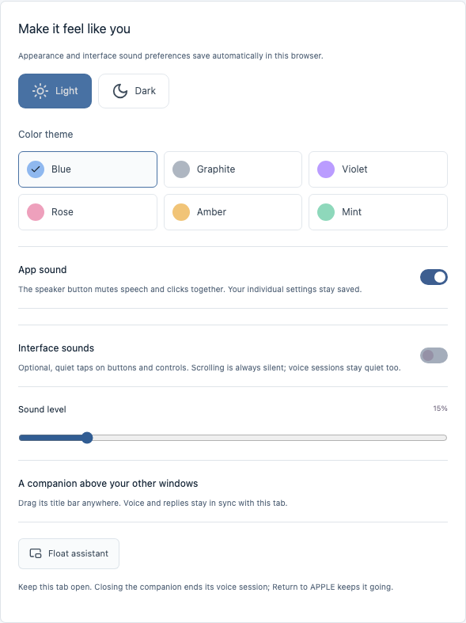

# APPLE

A personal macOS assistant for voice conversations, everyday tasks, WhatsApp messages, and learning from your documents.

**React + FastAPI · Local Ollama · MIT**


## Run locally

Requires **macOS**, **Python 3.10+**, **Node.js 22.12+**, and [Ollama](https://ollama.com/download/mac). Use desktop Chrome for voice and the floating companion.

```bash
git clone https://github.com/Abhishek09821/APPLE.git
cd APPLE
./setup.sh
ollama pull qwen3:8b
./start.sh
```

Open **[localhost:8000](http://127.0.0.1:8000)** and keep the terminal running. Start Ollama, then select your downloaded model in **Settings**. Basic app launches and searches work without a model.

## Get started

Enter your name and follow the skippable WhatsApp and library tour. Replay it or change your name in Settings.

| Feature | How to use it |
| --- | --- |
| Voice | Open **Assistant → Start listening**. Speak naturally; requests submit automatically. Use **Interrupt** or **Stop** when needed. |
| WhatsApp | Save the contact’s exact WhatsApp name, international number, and voice aliases in **Settings**. Then say “Send hello to Mum.” Requires installed WhatsApp and macOS Accessibility permission. |
| Documents | Upload **PDF, DOCX, TXT, or Markdown** in **Library**. Ask questions or start a spoken quiz with feedback. Scanned PDFs need OCR first. |
| Tasks & memory | Open apps, find files, save routines, or say “Remember that…”. Manage saved memories in Settings. |
| History | In **Activity**, search and delete one entry, selected entries, or all history. |
| Floating companion | Use the navbar’s window icon in Chrome. Drag the companion anywhere; keep the main tab open. |

## Make it yours

- **Six color themes:** Blue, Graphite, Violet, Rose, Amber, and Mint in **Settings → Color theme**, each with light and dark mode. Preferences save automatically.
- **Speaker button:** mute/unmute all app audio, including current speech and optional click sounds. Listening continues. Individual audio settings are preserved; scrolling is always silent.
- **Navigation:** always visible on Home; elsewhere, reveal it at the top edge or tap the handle. On phones, Home has a persistent toolbar with a menu button. The footer appears only on Home.

<p> </p>

## Privacy & limits

Your profile, documents, contacts, memories, and history stay in `backend/data/apple.db`. Model reasoning and Mac speech synthesis are local; browser dictation may use an online speech provider. Messaging and web searches need internet.

App control depends on macOS Accessibility and supported controls. APPLE cannot reliably control every application, and Stop cannot undo completed actions. See the in-app **FAQs** and **Privacy** pages for details.

## Development

```bash
./start.sh --dev                    # UI :5173 · API :8000
.venv/bin/python -m unittest discover -s backend/tests -v
cd frontend
npm test
npm run build
npm run format:check
```

Browser checks in `backend/tests/*_smoke.py` run against the local server. They cover navigation, themes, audio, onboarding, documents, and the floating companion. Voice checks use synthetic audio; they do not measure real-world recognition accuracy. Set `APPLE_DATA_DIR` for isolated backend test data.

## Contact

Built by **Abhishek Tiwari** · [Email](mailto:abhishek.tiwarii9821@gmail.com) · [LinkedIn](https://www.linkedin.com/in/abhishek-tiwari-3a3594300/) · [Issues](https://github.com/Abhishek09821/APPLE/issues)

Independent project; not affiliated with Apple Inc. [MIT License](LICENSE).
