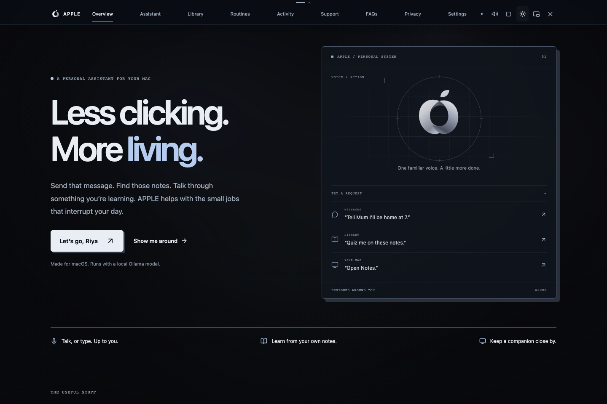
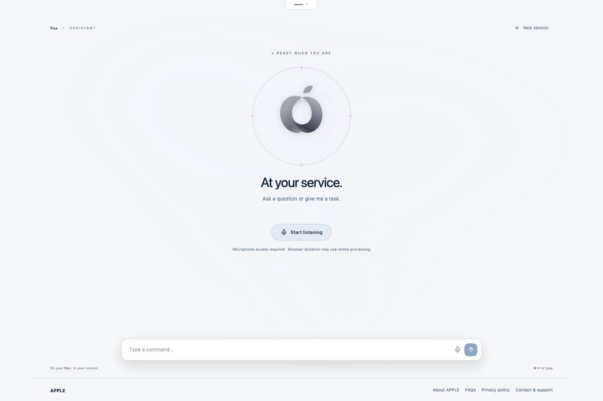
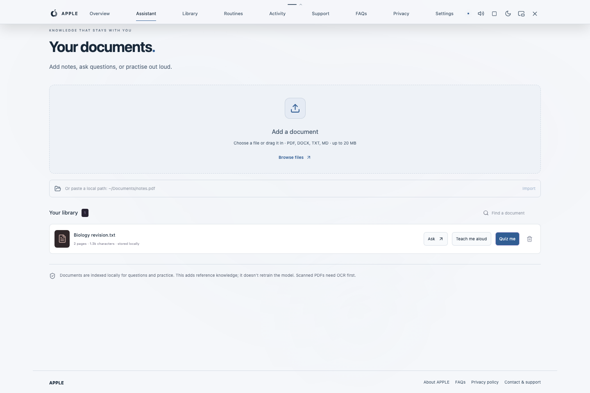
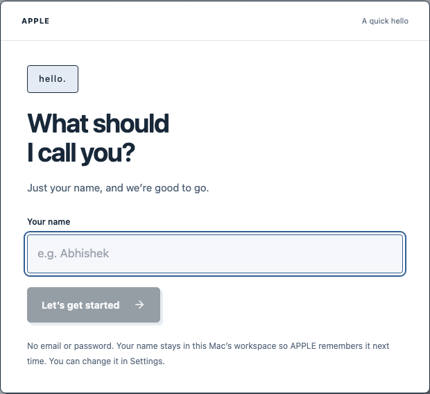
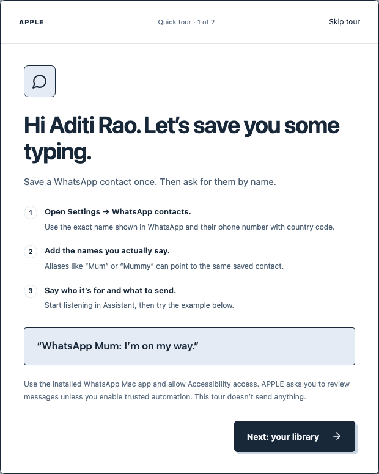
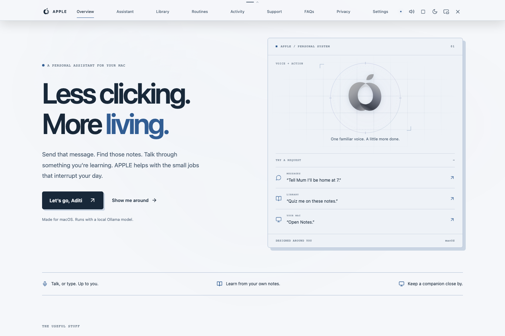
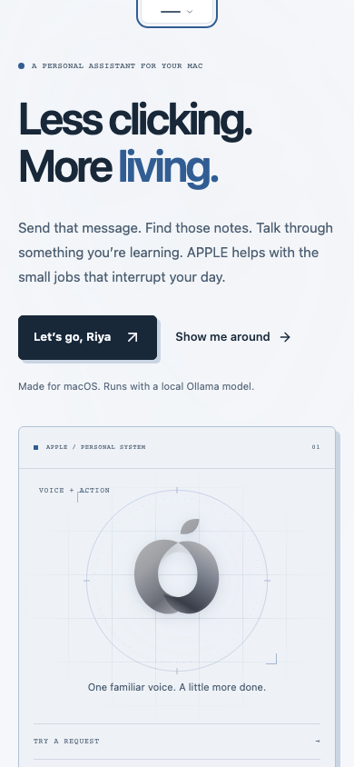
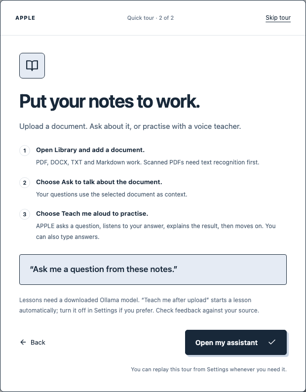

<div align="center">

# APPLE

**Your Mac. A little less back-and-forth.**

A personal macOS assistant for spoken conversations, everyday computer tasks, WhatsApp messages, and learning from your own documents.

[Quick start](#quick-start) · [First visit](#first-visit) · [WhatsApp](#whatsapp-messages) · [Library](#learn-from-your-documents) · [Development](#development) · [Contact](#contact)

**macOS** · **React + FastAPI** · **Local Ollama** · **[MIT license](LICENSE)**

</div>



APPLE is an independent project by **Abhishek Tiwari**, not affiliated with Apple Inc.

## What’s new

- One full-width navbar: move to the top edge to reveal it, choose a page and it slides away. Tap the handle on touchscreens; use Enter or ↓ from the focused handle with a keyboard. Escape closes it.
- The original charcoal, silver, and cool blue palette, with a console-style landing page, crisp neo-brutalist panels, subtle hover motion, consistent page margins, and light/dark themes.
- A **name-only welcome** that remembers your name across conversations and restarts. No email or password.
- A skippable introduction to **WhatsApp contacts** and the **document library**, replayable from Settings.
- **Silent scrolling**, with optional quieter click sounds. Interface sounds pause during voice sessions.
- Searchable activity with individual, selected, and complete history deletion.
- A movable floating assistant in desktop Chrome, sharing the main app’s voice session.

## A look inside

<table>
  <tr>
    <td width="50%"><br /><strong>The voice workspace</strong><br />Talk, type, or keep the assistant in a floating window.</td>
    <td width="50%"><br /><strong>Your document library</strong><br />Ask about a document or practise with a spoken lesson.</td>
  </tr>
  <tr>
    <td width="50%"><br /><strong>A quick hello</strong><br />One name, saved locally.</td>
    <td width="50%"><br /><strong>A useful first-run tour</strong><br />Learn where things are. Skip whenever you want.</td>
  </tr>
</table>

<details>
<summary>Light appearance, mobile layout, and the library tutorial</summary>



<p align="center"> </p>

</details>

*Screenshots show the running interface with demonstration names and documents. They contain no private contacts, conversation history, or real message sends.*

## Quick start

You’ll need **macOS**, **Python 3.10+**, **Node.js 22.12+**, and **npm**. Use desktop Chrome for voice input and the floating companion.

```bash
git clone https://github.com/Abhishek09821/APPLE.git
cd APPLE
./setup.sh
./start.sh
```

Open **[http://127.0.0.1:8000](http://127.0.0.1:8000)**. Keep the server running; Ctrl+C stops it. Port 8000 must be available.

The setup script installs Python dependencies, Playwright Chromium, and frontend dependencies, then builds the interface.

### Connect a local model

Install [Ollama for macOS](https://ollama.com/download/mac), then download a model that fits your Mac’s memory:

```bash
ollama pull qwen3:8b
ollama serve
```

If the Ollama app already runs its server, skip the second command. In APPLE → **Settings**, select the exact downloaded model name and save.

APPLE uses Ollama at `127.0.0.1:11434`. No model is bundled or downloaded automatically. Basic app launches and searches can work without a model; conversations, document answers, and semantic grading need one.

<details>
<summary>Optional native desktop window</summary>

```bash
./setup.sh --desktop
./start.sh --desktop
```

The pywebview window reuses an existing local server or starts its own. It closes a server it started when you exit. Voice recognition and Document Picture-in-Picture depend on browser support; use desktop Chrome for the full voice and floating-window experience.

</details>

## First visit

1. Enter the name you’d like APPLE to use. That is the whole welcome form.
2. Follow the two short tutorials: saved WhatsApp contacts, then the document library. **Skip tour** is available on either step.
3. Open Assistant and choose **Start listening**, or type a request.

Your name and tour completion are stored in the local database. The name is included in future conversational and document-answer context. Asking **“What is my name?”** works without a model. Change it under **Settings → A name to remember**, or choose **Replay welcome tour**.

This is one shared local workspace. The name personalizes it; it is not authentication or a separate account for each person.

## Things to try

| Say or type | What APPLE does |
| --- | --- |
| `Open Notes` | Finds and opens the installed app. |
| `Find file biology.pdf` | Searches the local Spotlight index. |
| `Search Bluetooth in System Settings` | Attempts a search through the app’s native controls. |
| `Inspect Calculator` | Reads available native controls. |
| `WhatsApp Mum: I’m on my way.` | Resolves a saved contact and attempts a verified native send. |
| `Mummy ko hii bhejo` | Uses Mummy’s saved name or alias. |
| `Remember that I prefer short explanations` | Saves an explicit fact for future conversations. |
| `Learn ~/Documents/biology.pdf` | Imports the document for questions and study. |
| `Run My morning` | Runs a routine you saved in Routines. |
| `Run shortcut Focus time` | Runs an existing macOS Shortcut after the applicable review. |

### WhatsApp messages

1. Install and sign in to the **WhatsApp Mac app**.
2. Open **Settings → WhatsApp contacts**. Enter the exact name shown in the chat, an international phone number including country code, and optional **Voice aliases** such as `Mum` or `Mummy`.
3. Allow APPLE’s launching application—Terminal, Codex, or Python as listed—in **System Settings → Privacy & Security → Accessibility**.
4. Say **“WhatsApp Mum: I’m on my way.”**

Saved contacts let APPLE resolve the recipient without asking the model to guess a number. The native adapter checks the recipient, edits the composer, presses a verified Send control once, and looks for the outgoing message. It uses the installed app, with no browser fallback. An outgoing message appearing in the UI is not proof of delivery.

One-time **Trusted automation** allows supported actions and messages you request to run without repeated in-app approval. Leave it off to review applicable actions first. Revoke it in Settings at any time. Browser microphone and macOS Accessibility permissions are separate.

If a send is uncertain, inspect the chat before retrying. An identical draft can be reused on an explicit retry. Multiline sends are currently rejected before typing, and WhatsApp updates can affect native control support.

### Learn from your documents

Open **Library** and upload a **PDF, DOCX, TXT, or Markdown** file. You can also drag a file in, enter its local path, or use a `Learn …` command.

- **Ask** selects the document for follow-up questions with source references.
- **Teach me aloud** asks a short question, accepts a spoken or typed answer, explains the result, and moves to the next question.
- **Quiz me** provides a written practice session with grading.
- **Teach me after upload** starts a voice lesson automatically. Switch it off in Settings if you prefer.

Say **“repeat question”** or **“end lesson”** during a voice lesson. Prepared questions are cached for the current document and model, so practising again starts a fresh score without regenerating the questions. Unusable generated questions fall back to a labelled source-review exercise.

Imports support up to **20 MB**, **1,000 PDF pages**, and **3 million extracted characters**. Unlock encrypted PDFs first; scanned image-only documents need OCR. DOCX references use sections unless explicit page breaks are available. Answers and grades can be wrong—check the cited source.

This is document retrieval, not model training. Removing a document deletes its index, not the original file. Historical answers and saved practice sessions can remain.

### Voice and the floating companion

Choose **Start listening** and allow microphone access. Final recognized speech submits automatically. Replies use macOS speech synthesis, and the APPLE mark responds to measured audio.

When the browser supports speaker echo cancellation, speaking during a reply can interrupt it. Otherwise, APPLE pauses recognition during playback and provides an **Interrupt** button. Say **“stop listening”** or use **Stop** to end the session. Recognition accuracy depends on your browser, language setting, microphone, and surroundings.

In desktop Chrome, choose **Float assistant** in the navbar. Drag its title bar to position it above other applications. It shares the existing microphone session, responses, and Stop control. Keep the original APPLE tab open. Closing the companion ends listening and speech; **Return to APPLE** keeps the voice session going.

Click sounds are optional and off by default for new browser profiles. **Scrolling never plays a sound.** Animations follow the system’s reduced-motion preference.

### History, memories, and routines

**Activity** shows the 100 most recent entries. Search, delete one, select several, or clear all activity, including older entries. Deletion requires an inline confirmation and removes those records from future conversation context. It does not delete your name, contacts, documents, explicit memories, study sessions, or messages already sent.

Use **“Remember that…”** to save an explicit fact. Review and forget those facts in Settings. In **Routines**, give a workflow a name and enter one command per line. Say **“Run [name]”** to use it. Execution stops at the first failed step.

## Privacy and current limits

- Profile, history, document text, contacts, memories, routines, and settings are stored locally in `backend/data/apple.db`. Browser appearance and sound preferences use local storage.
- Model reasoning and Mac speech synthesis run locally. **Browser dictation may send microphone audio to its speech provider.** Searches, external links, and requested messages use online services.
- The database is not encrypted by APPLE. Your Mac account, file permissions, and disk protection control access. The server binds to loopback, validates host/origin, and requires a process token for mutations; do not expose it publicly.
- APPLE can work only with supported tools and controls exposed through macOS Accessibility. Some native apps and web apps do not expose usable controls.
- There is no arbitrary shell execution, universal screen control, wake-word listener, OCR, automatic skill installation, or model fine-tuning. Search tools open results; they do not browse and summarize every page.
- **Stop** prevents further work but cannot undo completed actions or reliably revoke work already accepted by another application.

Read the in-app **Privacy policy** and **FAQs** from the navbar or footer for more detail.

## Development

```bash
./start.sh --dev
# Frontend: http://127.0.0.1:5173
# Backend:  http://127.0.0.1:8000
```

| Location | Responsibility |
| --- | --- |
| `frontend/src/App.jsx` | Sessions, navigation, profile, voice, and command orchestration. |
| `frontend/src/components/` | Landing page, welcome tour, assistant, library, activity, and settings. |
| `frontend/src/hooks/` | Recognition, playback, floating window, preferences, and optional click feedback. |
| `backend/main.py` | Loopback API, streaming execution, approvals, and lifecycle. |
| `backend/user_profile.py` | Validated display name, tour state, and personalization context. |
| `backend/ai_parser.py` | Explicit command parsing and local model plans. |
| `backend/desktop_automation.py`, `backend/app_agent.py` | Native Accessibility controls and bounded multi-step app tasks. |
| `backend/contacts.py`, `backend/whatsapp_native.py` | Saved recipients and verified native WhatsApp actions. |
| `backend/knowledge.py` | Document extraction, retrieval, questions, and grading. |
| `backend/storage.py`, `backend/memory.py` | SQLite persistence and explicit user memories. |

Set `APPLE_DATA_DIR` to a separate directory when working with test data. Do not commit personal database files or contact information.

### Checks

```bash
.venv/bin/python -m unittest discover -s backend/tests -v
cd frontend
npm test
npm run build
npm run format:check
```

With the local server running and Playwright Chromium installed, run from the repository root:

```bash
.venv/bin/python backend/tests/onboarding_smoke.py
.venv/bin/python backend/tests/product_smoke.py
.venv/bin/python backend/tests/voice_smoke.py
.venv/bin/python backend/tests/contacts_smoke.py
.venv/bin/python backend/tests/browser_smoke.py
```

The onboarding test checks name entry, failed-save recovery, tour skipping/replay, all page widths, and mobile navigation. It regenerates the screenshots in `docs/images/` using isolated fixtures. Product tests cover silent scrolling, optional click feedback, history deletion, themes, and a real Chrome Picture-in-Picture window.

Voice checks use synthetic microphone audio and mocked recognition/model responses. They verify session behavior, interruption, audio-level motion, cleanup, and a complete document lesson—not real-world transcription or acoustic cancellation quality. The general browser smoke test creates and removes a temporary note and routine. No browser test sends a real message or runs desktop actions.

## Contact

Built by **Abhishek Tiwari**.

- [Email / support](mailto:abhishek.tiwarii9821@gmail.com)
- [LinkedIn](https://www.linkedin.com/in/abhishek-tiwari-3a3594300/)
- [Report an issue](https://github.com/Abhishek09821/APPLE/issues)

For a bug report, include your macOS/browser versions, steps to reproduce, and the result you expected. Remove private contacts, messages, and document contents from screenshots.

Released under the [MIT License](LICENSE).
